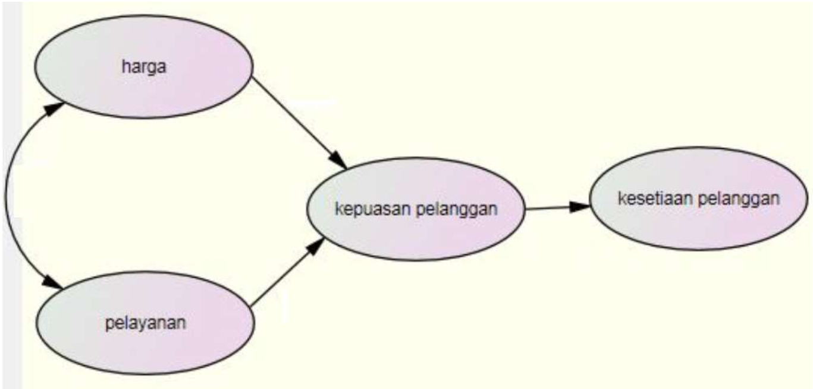
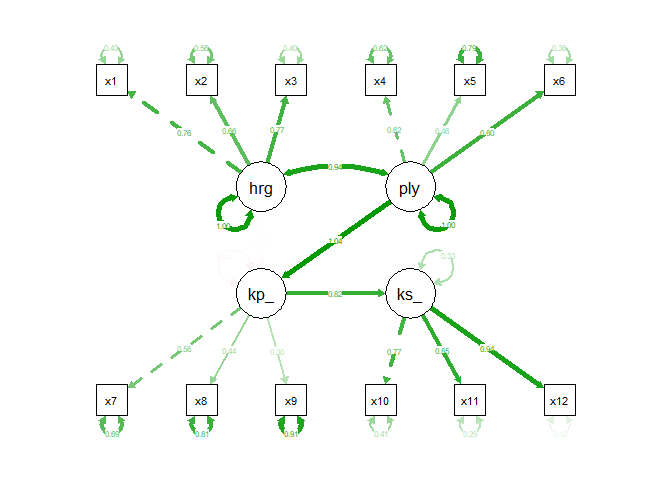

Analisis SEM
================

## Persoalan

Soal:

Lakukan analisis SEM dengan data yang tersedia (Refer to IC_Data
SEM.xlsx)

Terdapat 97 data dengan 4 variabel laten (“Harga”, “Pelayanan”,
“Kepuasan Pelanggan”, dan “Kesetiaan Pelanggan”).

Variabel laten tersebut memiliki indikator sebagai berikut:

- Variabel “harga”: x1, x2, dan x3

- Variabel “pelayanan”: x4, x5, dan x6

- Variabel “kepuasan pelanggan”: x7, x8, dan x9

- Variabel “kesetiaan pelanggan”: x10, x11, x12

Dengan model struktural sebagai berikut



a\. Kriteria goodnes of fit model structural

b\. Bagaimana interpretasi hasil kepuasan pelanggan

c\. Bagaimana interpretasi hasil kesetiaan pelanggan

## Coding

### Library dan Read Data

``` r
#Library untuk data excel
library(readxl)

#Library untuk SEM
library(semPlot)
library(lavaan)
```

    ## This is lavaan 0.6-19
    ## lavaan is FREE software! Please report any bugs.

``` r
#Membaca file data excel
data <- read_excel("10_SEM/IC_Data SEM.xlsx")

#Mengecek file excel sudah dapat terbaca
View(data)
head(data)
```

    ## # A tibble: 6 × 13
    ##   Nama      x1    x2    x3    x4    x5    x6    x7    x8    x9   x10   x11   x12
    ##   <chr>  <dbl> <dbl> <dbl> <dbl> <dbl> <dbl> <dbl> <dbl> <dbl> <dbl> <dbl> <dbl>
    ## 1 Afika…     5     5     5     2     5     4     5     5     2     5     5     4
    ## 2 Agung…     4     2     4     2     4     4     1     3     4     3     3     3
    ## 3 Alifah     4     4     4     3     4     4     3     4     3     4     3     3
    ## 4 Ameli…     4     3     2     3     4     2     2     4     3     3     3     3
    ## 5 Angga…     4     4     3     3     4     4     4     4     3     4     5     4
    ## 6 Anggi…     4     3     3     4     4     3     2     3     4     4     3     4

Dari sini terlihat bahwa data sudah terbaca dengan baik, di mana
terdapat 12 kolom yang berlaku sebagai indikator dari setiap konstruk
yang terlihat di model struktural.

### Mendefinisikan Struktur SEM

``` r
#Struktur SEM
model <- 'harga =~ x1+x2+x3
pelayanan =~ x4+x5+x6
kepuasan_pelanggan =~ x7+x8+x9
kesetiaan_pelanggan =~ x10+x11+x12
kepuasan_pelanggan ~ harga+pelayanan
kesetiaan_pelanggan ~ kepuasan_pelanggan
'

#Model Fit
fitsem <- sem(model, data = data)
```

    ## Warning: lavaan->lav_object_post_check():  
    ##    some estimated lv variances are negative

``` r
fitcfa <- cfa(model, data = data)
```

    ## Warning: lavaan->lav_object_post_check():  
    ##    some estimated lv variances are negative

Berikut ini kita definisikan struktur SEM dan bentuk modelnya.

### Jawaban Soal A: Goodness of Fit Structural Model

``` r
#Uji goodness of fit model structural
fitmeasures(fitsem,c("chisq","gfi","agfi","ifi","tli","cfi","nfi","rmsea"))
```

    ##  chisq    gfi   agfi    ifi    tli    cfi    nfi  rmsea 
    ## 62.502  0.910  0.859  0.975  0.966  0.974  0.887  0.051

| Indeks     | Cutoff Value | Hasil  | Evaluasi |
|------------|--------------|--------|----------|
| Chi-square | =\< 120.990  | 65.502 | Fit      |
| GFI        | \>0.90       | 0.910  | Fit      |
| AGFI       | \>0.90       | 0.859  | Marginal |
| IFI        | \>0.90       | 0.975  | Fit      |
| TLI        | \>0.90       | 0.966  | Fit      |
| CFI        | \>0.90       | 0.974  | Fit      |
| NFI        | \>0.90       | 0.887  | Marginal |
| RMSEA      | \<0.08       | 0.051  | Fit      |

Berdasarkan hasil di atas, dapat dinyatakan bahwa model baik (Model
Fit), memenuhi persyaratan goodness-of-fit. Model SEM dianggap sudah
mampu menjelaskan dataset sampel.

### Jawaban Soal B: Interpretasi “Kepuasan Pelanggan”

``` r
#Gambar model structural
semPaths(fitcfa, what = "std")
```

<!-- -->

``` r
semPaths(fitsem, what = "std")

#Analisis Model Fit
summary (fitsem, standardized=TRUE)
```

    ## lavaan 0.6-19 ended normally after 44 iterations
    ## 
    ##   Estimator                                         ML
    ##   Optimization method                           NLMINB
    ##   Number of model parameters                        28
    ## 
    ##   Number of observations                            97
    ## 
    ## Model Test User Model:
    ##                                                       
    ##   Test statistic                                62.502
    ##   Degrees of freedom                                50
    ##   P-value (Chi-square)                           0.110
    ## 
    ## Parameter Estimates:
    ## 
    ##   Standard errors                             Standard
    ##   Information                                 Expected
    ##   Information saturated (h1) model          Structured
    ## 
    ## Latent Variables:
    ##                          Estimate  Std.Err  z-value  P(>|z|)   Std.lv  Std.all
    ##   harga =~                                                                    
    ##     x1                      1.000                               0.677    0.757
    ##     x2                      0.755    0.121    6.232    0.000    0.511    0.661
    ##     x3                      0.861    0.118    7.326    0.000    0.583    0.774
    ##   pelayanan =~                                                                
    ##     x4                      1.000                               0.617    0.619
    ##     x5                      0.544    0.137    3.961    0.000    0.335    0.457
    ##     x6                      1.216    0.199    6.119    0.000    0.750    0.797
    ##   kepuasan_pelanggan =~                                                       
    ##     x7                      1.000                               0.650    0.557
    ##     x8                      0.487    0.133    3.672    0.000    0.317    0.439
    ##     x9                      0.383    0.146    2.623    0.009    0.249    0.297
    ##   kesetiaan_pelanggan =~                                                      
    ##     x10                     1.000                               0.615    0.769
    ##     x11                     1.191    0.133    8.940    0.000    0.733    0.845
    ##     x12                     1.345    0.137    9.827    0.000    0.827    0.939
    ## 
    ## Regressions:
    ##                         Estimate  Std.Err  z-value  P(>|z|)   Std.lv  Std.all
    ##   kepuasan_pelanggan ~                                                       
    ##     harga                 -0.018    0.823   -0.022    0.983   -0.019   -0.019
    ##     pelayanan              1.095    0.949    1.154    0.249    1.039    1.039
    ##   kesetiaan_pelanggan ~                                                      
    ##     kepuasn_plnggn         0.774    0.156    4.948    0.000    0.818    0.818
    ## 
    ## Covariances:
    ##                    Estimate  Std.Err  z-value  P(>|z|)   Std.lv  Std.all
    ##   harga ~~                                                              
    ##     pelayanan         0.392    0.089    4.382    0.000    0.937    0.937
    ## 
    ## Variances:
    ##                    Estimate  Std.Err  z-value  P(>|z|)   Std.lv  Std.all
    ##    .x1                0.342    0.063    5.393    0.000    0.342    0.427
    ##    .x2                0.338    0.055    6.090    0.000    0.338    0.563
    ##    .x3                0.228    0.044    5.196    0.000    0.228    0.401
    ##    .x4                0.614    0.098    6.284    0.000    0.614    0.617
    ##    .x5                0.426    0.064    6.703    0.000    0.426    0.791
    ##    .x6                0.323    0.073    4.421    0.000    0.323    0.365
    ##    .x7                0.940    0.144    6.505    0.000    0.940    0.690
    ##    .x8                0.419    0.062    6.745    0.000    0.419    0.807
    ##    .x9                0.644    0.094    6.882    0.000    0.644    0.912
    ##    .x10               0.262    0.043    6.075    0.000    0.262    0.409
    ##    .x11               0.215    0.041    5.268    0.000    0.215    0.286
    ##    .x12               0.093    0.035    2.677    0.007    0.093    0.119
    ##     harga             0.459    0.111    4.116    0.000    1.000    1.000
    ##     pelayanan         0.381    0.120    3.172    0.002    1.000    1.000
    ##    .kepuasn_plnggn   -0.018    0.062   -0.298    0.766   -0.044   -0.044
    ##    .kesetin_plnggn    0.125    0.041    3.069    0.002    0.330    0.330

``` r
summary (fitcfa, standardized=TRUE)
```

    ## lavaan 0.6-19 ended normally after 44 iterations
    ## 
    ##   Estimator                                         ML
    ##   Optimization method                           NLMINB
    ##   Number of model parameters                        28
    ## 
    ##   Number of observations                            97
    ## 
    ## Model Test User Model:
    ##                                                       
    ##   Test statistic                                62.502
    ##   Degrees of freedom                                50
    ##   P-value (Chi-square)                           0.110
    ## 
    ## Parameter Estimates:
    ## 
    ##   Standard errors                             Standard
    ##   Information                                 Expected
    ##   Information saturated (h1) model          Structured
    ## 
    ## Latent Variables:
    ##                          Estimate  Std.Err  z-value  P(>|z|)   Std.lv  Std.all
    ##   harga =~                                                                    
    ##     x1                      1.000                               0.677    0.757
    ##     x2                      0.755    0.121    6.232    0.000    0.511    0.661
    ##     x3                      0.861    0.118    7.326    0.000    0.583    0.774
    ##   pelayanan =~                                                                
    ##     x4                      1.000                               0.617    0.619
    ##     x5                      0.544    0.137    3.961    0.000    0.335    0.457
    ##     x6                      1.216    0.199    6.119    0.000    0.750    0.797
    ##   kepuasan_pelanggan =~                                                       
    ##     x7                      1.000                               0.650    0.557
    ##     x8                      0.487    0.133    3.672    0.000    0.317    0.439
    ##     x9                      0.383    0.146    2.623    0.009    0.249    0.297
    ##   kesetiaan_pelanggan =~                                                      
    ##     x10                     1.000                               0.615    0.769
    ##     x11                     1.191    0.133    8.940    0.000    0.733    0.845
    ##     x12                     1.345    0.137    9.827    0.000    0.827    0.939
    ## 
    ## Regressions:
    ##                         Estimate  Std.Err  z-value  P(>|z|)   Std.lv  Std.all
    ##   kepuasan_pelanggan ~                                                       
    ##     harga                 -0.018    0.823   -0.022    0.983   -0.019   -0.019
    ##     pelayanan              1.095    0.949    1.154    0.249    1.039    1.039
    ##   kesetiaan_pelanggan ~                                                      
    ##     kepuasn_plnggn         0.774    0.156    4.948    0.000    0.818    0.818
    ## 
    ## Covariances:
    ##                    Estimate  Std.Err  z-value  P(>|z|)   Std.lv  Std.all
    ##   harga ~~                                                              
    ##     pelayanan         0.392    0.089    4.382    0.000    0.937    0.937
    ## 
    ## Variances:
    ##                    Estimate  Std.Err  z-value  P(>|z|)   Std.lv  Std.all
    ##    .x1                0.342    0.063    5.393    0.000    0.342    0.427
    ##    .x2                0.338    0.055    6.090    0.000    0.338    0.563
    ##    .x3                0.228    0.044    5.196    0.000    0.228    0.401
    ##    .x4                0.614    0.098    6.284    0.000    0.614    0.617
    ##    .x5                0.426    0.064    6.703    0.000    0.426    0.791
    ##    .x6                0.323    0.073    4.421    0.000    0.323    0.365
    ##    .x7                0.940    0.144    6.505    0.000    0.940    0.690
    ##    .x8                0.419    0.062    6.745    0.000    0.419    0.807
    ##    .x9                0.644    0.094    6.882    0.000    0.644    0.912
    ##    .x10               0.262    0.043    6.075    0.000    0.262    0.409
    ##    .x11               0.215    0.041    5.268    0.000    0.215    0.286
    ##    .x12               0.093    0.035    2.677    0.007    0.093    0.119
    ##     harga             0.459    0.111    4.116    0.000    1.000    1.000
    ##     pelayanan         0.381    0.120    3.172    0.002    1.000    1.000
    ##    .kepuasn_plnggn   -0.018    0.062   -0.298    0.766   -0.044   -0.044
    ##    .kesetin_plnggn    0.125    0.041    3.069    0.002    0.330    0.330

Dari hasil di atas pada “Regression”, didapatkan sebagai berikut:

- “Kepuasan Pelanggan” sangat dipengaruhi oleh “Pelayanan” karena nilai
  std.all 1.04 (jauh di atas 0.5)

- “Kepuasan Pelanggan” tidak dipengaruhi oleh “Harga” karena nilai
  std.all adalah minus (di bawah 0.5)

- “Kepuasan Pelanggan mempengaruhi”Kesetiaan Pelanggan” karena nilai
  std.all 0.82 (di atas 0.5)

- Indikator x7, x8, dan x9 kurang bisa menjelaskan konstruk “Kepuasan
  Pelanggan” karena nilai std.all di bawah 0.5

### Jawaban Soal C: Interpretasi “Kesetiaan Pelanggan”

Melihat dari hasil sebelumnya pada poin (b), didapatkan sebagai berikut:

- “Kesetiaan Pelanggan” dipengaruhi oleh kosntruk “Kepuasan Pelanggan”

- Indikator x10, x11, dan x12 dapat menjelaskan konstruk “Kesetiaan
  Pelanggan” dengan baik

