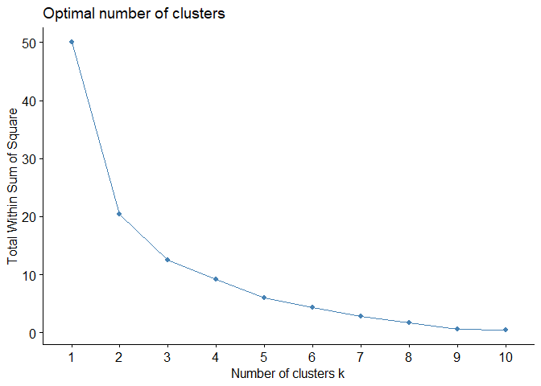
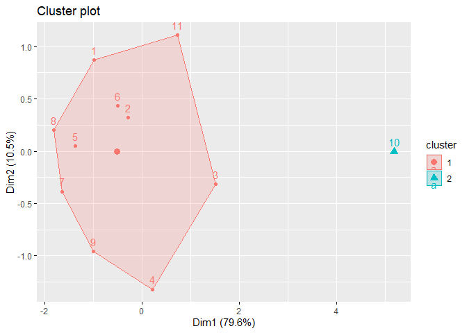

Analisis Cluster
================

**Analisis cluster** adalah metode statistik yang digunakan untuk
mengelompokkan data ke dalam beberapa kelompok (cluster) berdasarkan
kemiripan karakteristik, dengan tujuan agar data dalam satu kelompok
memiliki kesamaan tinggi dan berbeda secara jelas dari kelompok lainnya.

## Persoalan

Soal:

Lakukan analisis cluster dengan data yang tersedia (Refer to IC_Data
Analisis Cluster.xlsx)

Terdapat 11 data dengan 5 variabel.

## Metode Yang Digunakan

Metode yang akan digunakan untuk analisis cluster adalah menggunakan
K-Means Clustering. Sebelum melakukan K-Means Clustering, nilai “K”
harus ditentukan. Dua metode yang akan digunakan untuk mengetahui nilai
“K” adalah:

a\. Metode Elbow

b\. Metode Silhouette

## Coding

### Library dan Read Data

``` r
#Library untuk data excel
library(readxl)

#Library untuk clustering
library(cluster)
library(factoextra)
```

    ## Loading required package: ggplot2

    ## Welcome! Want to learn more? See two factoextra-related books at https://goo.gl/ve3WBa

``` r
#Membaca file data excel
data <- read_excel("11_Analisis Kluster/IC_Data Analisis Cluster.xlsx")

#Mengecek file excel sudah dapat terbaca
View(data)
head(data)
```

    ## # A tibble: 6 × 6
    ##   Kota     X1    X2    X3    X4    X5
    ##   <chr> <dbl> <dbl> <dbl> <dbl> <dbl>
    ## 1 A      59.8  62.5  11.8  8.88  5600
    ## 2 C      62.7  64.0  12.1  8.71  6804
    ## 3 D      68.7  65.6  13.6  8.88  9547
    ## 4 E      65.2  65.5  12.2  7.15  9420
    ## 5 F      59.9  61.6  11.0  7.98  6891
    ## 6 G      62.4  59.9  12.7  8.42  7779

Dari sini terlihat bahwa data sudah bisa terbaca dengan baik, di mana
terdapat 5 variabel dengan 11 baris data yang merupakan data perkotaan.

### Normalisasi Data

Sebelum melanjutkan pengolahan data, perlu dilakukan normalisasi data
karena pada setiap variabel memiliki satuan yang berbeda yang dapat
mempengaruhi hasil pengolahan data.

``` r
#Normalisasi data (karena satuan yang berbeda)
normdata <- scale(data[2:6])
head(normdata)
```

    ##              X1         X2         X3           X4          X5
    ## [1,] -0.6579933 -0.2352604 -0.5074674  0.334780489 -1.09284092
    ## [2,] -0.1665188  0.2179987 -0.3305934  0.214619354 -0.53154467
    ## [3,]  0.8315266  0.7110711  0.7235751  0.334780489  0.74722246
    ## [4,]  0.2377315  0.6835080 -0.2103192 -0.888035770  0.68801596
    ## [5,] -0.6412194 -0.5200786 -1.0593140 -0.301366698 -0.49098589
    ## [6,] -0.2252274 -1.0315264  0.1222038  0.009638594 -0.07700659

Di atas ini, merupakan potongan dari data yang telah dinormalisasi.

### Scree Plot: Menentukan Nilai K

``` r
#Scree Plot (menentukan jumlah kluster)
fviz_nbclust(normdata, kmeans, method = "wss") #metode elbow
```

<!-- -->

Metode ini menggunakan analisis hasil grafis dengan melihat pada titik
mana terdapat patahan garis yang paling besar layaknya “elbow” atau
sikut. Berdasarkan plot di ats, ditemukan bahwa jumlah kluster yang
optimal adalah 2 kluster

``` r
#Scree Plot (menentukan jumlah kluster)
fviz_nbclust(normdata, kmeans, method = "silhouette") #metode silhouette
```

<!-- -->

Metode ini menggunakan analisis hasil grafis dengan melihat pada titik
mana yang merupakan puncaknya. Titik tertinggi di grafik menunjukkan
jumlah cluster dengan pemisahan terbaik. Berdasarkan plot di atas,
ditemukan bahwa jumlah kluster yang optimal adalah 2 kluster

### Clustering dengan K-Means Clustering

``` r
#K-means dengan cluster = 2
final2 <- kmeans(normdata,2,nstart=25)
final2
```

    ## K-means clustering with 2 clusters of sizes 10, 1
    ## 
    ## Cluster means:
    ##           X1         X2        X3         X4         X5
    ## 1 -0.2576009 -0.1896282 -0.237204 -0.2264427 -0.2425051
    ## 2  2.5760093  1.8962824  2.372040  2.2644270  2.4250507
    ## 
    ## Clustering vector:
    ##  [1] 1 1 1 1 1 1 1 1 1 2 1
    ## 
    ## Within cluster sum of squares by cluster:
    ## [1] 20.44654  0.00000
    ##  (between_SS / total_SS =  59.1 %)
    ## 
    ## Available components:
    ## 
    ## [1] "cluster"      "centers"      "totss"        "withinss"     "tot.withinss"
    ## [6] "betweenss"    "size"         "iter"         "ifault"

``` r
fviz_cluster(final2, data = normdata)
```

<!-- -->

Hasil clustering di atas menunjukkan pemisahan cluster dengan
interpretasi sebagai berikut:

- Cluster 1: Kota A, C, D, E, F, G, H, I, J, L

- Cluster 2: Kota K

