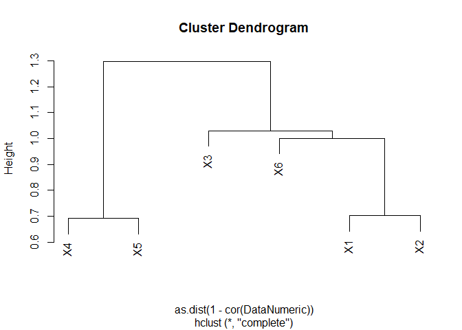
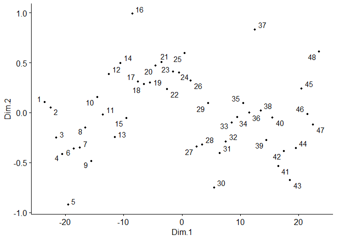
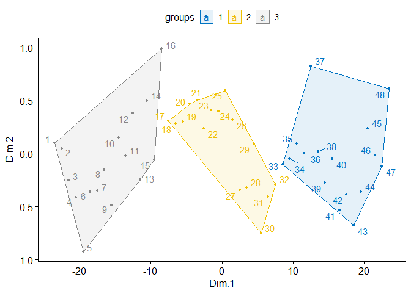

Analisis Multi-dimensional Scaling
================

**Multidimensional scaling (MDS)** adalah metode statistik yang
digunakan untuk memvisualisasikan tingkat kemiripan atau perbedaan antar
objek dalam bentuk peta atau ruang berdimensi rendah, sehingga hubungan
antar objek lebih mudah dipahami.

## Persoalan

Soal:

Lakukan analisis multi-dimensional scaling dengan data yang tersedia
(Refer to IC_Data MDS.xlsx)

Terdapat 48 data dengan 6 variabel

## Coding

### Library dan Read Data

``` r
#Library untuk data excel
library(readxl)

#Library untuk MDS
library(magrittr)
library(dplyr)
```

    ## 
    ## Attaching package: 'dplyr'

    ## The following objects are masked from 'package:stats':
    ## 
    ##     filter, lag

    ## The following objects are masked from 'package:base':
    ## 
    ##     intersect, setdiff, setequal, union

``` r
library(ggpubr)
```

    ## Loading required package: ggplot2

``` r
library(MASS)
```

    ## 
    ## Attaching package: 'MASS'

    ## The following object is masked from 'package:dplyr':
    ## 
    ##     select

``` r
#Membaca file data excel
data <- read_excel("12_Multidimensional Scaling/IC_Data MDS.xlsx")

#Mengecek file excel sudah dapat terbaca
View(data)
head(data)
```

    ## # A tibble: 6 × 7
    ##   Responden    X1    X2    X3    X4    X5    X6
    ##       <dbl> <dbl> <dbl> <dbl> <dbl> <dbl> <dbl>
    ## 1         1  3.5   3.67  3.67  3.67  4.17  3.67
    ## 2         2  3.83  3.67  3.5   3.5   4     3.5 
    ## 3         3  3.67  3.67  3.83  3.5   3.83  3.33
    ## 4         4  3.17  3.5   3.33  3.5   3.5   3.5 
    ## 5         5  3     3.67  3.83  3.33  3.17  3.33
    ## 6         6  3.33  3.67  3.5   3.17  4     3.33

``` r
#Subset data -> Untuk mengambil data x1-x6 tanpa kolom "responden"
DataNumeric = subset(data, select=c(2,3,4,5,6,7))
head(DataNumeric)
```

    ## # A tibble: 6 × 6
    ##      X1    X2    X3    X4    X5    X6
    ##   <dbl> <dbl> <dbl> <dbl> <dbl> <dbl>
    ## 1  3.5   3.67  3.67  3.67  4.17  3.67
    ## 2  3.83  3.67  3.5   3.5   4     3.5 
    ## 3  3.67  3.67  3.83  3.5   3.83  3.33
    ## 4  3.17  3.5   3.33  3.5   3.5   3.5 
    ## 5  3     3.67  3.83  3.33  3.17  3.33
    ## 6  3.33  3.67  3.5   3.17  4     3.33

``` r
#Matrix dari data
DataNumericMatrix = as.matrix(DataNumeric)
print(DataNumericMatrix)
```

    ##             X1       X2       X3       X4       X5       X6
    ##  [1,] 3.500000 3.666667 3.666667 3.666667 4.166667 3.666667
    ##  [2,] 3.833333 3.666667 3.500000 3.500000 4.000000 3.500000
    ##  [3,] 3.666667 3.666667 3.833333 3.500000 3.833333 3.333333
    ##  [4,] 3.166667 3.500000 3.333333 3.500000 3.500000 3.500000
    ##  [5,] 3.000000 3.666667 3.833333 3.333333 3.166667 3.333333
    ##  [6,] 3.333333 3.666667 3.500000 3.166667 4.000000 3.333333
    ##  [7,] 3.333333 3.833333 3.500000 3.333333 3.666667 3.500000
    ##  [8,] 3.333333 3.833333 3.500000 3.500000 4.000000 3.166667
    ##  [9,] 3.000000 3.500000 3.500000 3.333333 4.000000 3.000000
    ## [10,] 3.333333 3.666667 2.833333 3.666667 4.000000 3.166667
    ## [11,] 3.500000 4.166667 3.500000 3.500000 3.833333 3.500000
    ## [12,] 4.000000 4.166667 3.000000 3.666667 3.666667 3.666667
    ## [13,] 3.833333 3.500000 2.833333 3.333333 3.666667 2.500000
    ## [14,] 3.666667 3.666667 3.000000 3.666667 4.333333 3.666667
    ## [15,] 3.333333 3.833333 3.166667 3.166667 4.333333 3.166667
    ## [16,] 4.000000 4.333333 3.166667 4.166667 4.500000 3.166667
    ## [17,] 4.000000 4.166667 3.500000 4.000000 3.833333 2.833333
    ## [18,] 3.500000 3.833333 3.833333 4.000000 4.500000 2.833333
    ## [19,] 3.833333 4.000000 3.166667 3.666667 4.166667 2.833333
    ## [20,] 3.833333 4.166667 3.333333 3.500000 4.500000 3.333333
    ## [21,] 3.500000 4.000000 3.833333 4.000000 4.333333 4.000000
    ## [22,] 3.666667 4.000000 3.333333 3.500000 4.166667 3.500000
    ## [23,] 3.166667 4.000000 3.500000 4.000000 4.500000 3.166667
    ## [24,] 3.833333 3.833333 4.000000 3.833333 4.666667 3.166667
    ## [25,] 3.666667 3.833333 3.500000 4.166667 4.333333 3.333333
    ## [26,] 4.166667 3.333333 3.500000 3.500000 4.500000 3.333333
    ## [27,] 3.166667 3.833333 4.000000 3.833333 3.666667 3.166667
    ## [28,] 3.666667 4.000000 3.666667 3.166667 4.000000 2.833333
    ## [29,] 3.666667 3.833333 3.500000 3.500000 4.000000 3.666667
    ## [30,] 3.666667 3.333333 4.333333 3.000000 4.000000 3.166667
    ## [31,] 3.500000 4.500000 3.666667 2.666667 4.000000 3.500000
    ## [32,] 3.833333 4.333333 3.833333 3.166667 3.833333 3.000000
    ## [33,] 3.500000 4.166667 3.666667 3.500000 3.833333 3.333333
    ## [34,] 4.000000 4.166667 4.166667 3.166667 4.500000 3.000000
    ## [35,] 3.333333 4.500000 3.666667 3.333333 4.500000 3.000000
    ## [36,] 3.833333 4.500000 4.000000 3.166667 4.500000 2.833333
    ## [37,] 4.000000 4.500000 3.333333 4.000000 4.166667 3.666667
    ## [38,] 3.500000 4.166667 4.000000 3.666667 4.166667 3.166667
    ## [39,] 3.333333 4.000000 3.666667 3.166667 4.000000 3.500000
    ## [40,] 3.333333 4.500000 3.666667 3.333333 4.000000 3.500000
    ## [41,] 3.333333 3.666667 3.833333 3.500000 3.666667 2.833333
    ## [42,] 3.833333 4.500000 4.333333 3.166667 3.833333 3.166667
    ## [43,] 3.666667 4.000000 3.666667 2.833333 3.833333 2.500000
    ## [44,] 4.000000 4.166667 4.166667 3.166667 3.666667 3.500000
    ## [45,] 3.833333 4.000000 3.333333 3.833333 4.000000 2.666667
    ## [46,] 4.000000 4.500000 3.833333 3.333333 3.666667 3.666667
    ## [47,] 3.833333 3.500000 3.500000 3.500000 3.833333 3.166667
    ## [48,] 4.000000 4.500000 3.500000 3.666667 4.166667 3.833333

``` r
print(cor(DataNumeric))
```

    ##              X1          X2           X3          X4          X5           X6
    ## X1  1.000000000  0.29799739 -0.009620941  0.10548508  0.24130298 -0.001345809
    ## X2  0.297997389  1.00000000  0.187348231 -0.04779238  0.16161766  0.124363636
    ## X3 -0.009620941  0.18734823  1.000000000 -0.29631169 -0.03012627 -0.030341590
    ## X4  0.105485077 -0.04779238 -0.296311693  1.00000000  0.30755935  0.143739811
    ## X5  0.241302985  0.16161766 -0.030126268  0.30755935  1.00000000 -0.033729961
    ## X6 -0.001345809  0.12436364 -0.030341590  0.14373981 -0.03372996  1.000000000

Dari sini terlihat bahwa data sudah terbaca dengan baik, di mana
terdapat 6 variabel dan 48 baris data. Terlihat juga di coding bahwa
dilakukan subset data, hal ini dilakukan untuk meng-exclude kolom
“Responden”.

Kemudian terlihat bahwa subset data sudah berjalan dengan benar.
Selanjutnya data diubah ke dalam bentuk matrix untuk melanjutkan ke
pengolahan data.

### Cluster Dendogram

``` r
#Buat dendogram
plot(hclust(as.dist(1-cor(DataNumeric))))
```

<!-- -->

Dendogram digunakan untuk mengetahui jumlah cluster yang membagi data.
Berdasarkan hasil dendogram ditemukan bahwa terdapat 3 kluster yang
mungkin membagi dataset.

### Chart MDS

``` r
#Mencari solusi MDS dengan Kruskal's multidimensional scalling
mds <- data %>%
  dist() %>%          
  cmdscale() %>%
  as_tibble()
```

    ## Warning: The `x` argument of `as_tibble.matrix()` must have unique column names if
    ## `.name_repair` is omitted as of tibble 2.0.0.
    ## ℹ Using compatibility `.name_repair`.
    ## This warning is displayed once every 8 hours.
    ## Call `lifecycle::last_lifecycle_warnings()` to see where this warning was
    ## generated.

``` r
colnames(mds) <- c("Dim.1", "Dim.2")
# Plot MDS
ggscatter(mds, x = "Dim.1", y = "Dim.2", 
          label = rownames(data),
          size = 1,
          repel = TRUE)
```

<!-- -->

Chart MDS bertujuan untuk menyederhanakan visualisasi jarak data
sehingga bisa diplot dalam bidang dua dimensi. Chart MDS inilah yang
kemudian digunakan untuk melihat pola suatu data apakah membentuk
kelompok tertentu. Untuk membantu melihat pola tersebut, dilakukanlah
K-Means Clustering setelah ini.

### K-Means Clustering (k=3)

``` r
# K-means clustering agar terlihat kluster akhir
clust <- kmeans(mds, 3)$cluster %>%
  as.factor()
mds <- mds %>%
  mutate(groups = clust)
# Plot and color by groups
ggscatter(mds, x = "Dim.1", y = "Dim.2", 
          label = rownames(data),
          color = "groups",
          palette = "jco",
          size = 1, 
          ellipse = TRUE,
          ellipse.type = "convex",
          repel = TRUE)
```

<!-- -->

Hasil K-Means clustering menunjukkan pembagian kelompok pada dataset.
MDS hanya memproyeksikan jarak dan tidak otomatis dapat mengelompokkan
data.

Berdasarkan hasil di atas, ditemukan bahwa:

- Kluster 1: Data ke-1 sampai 16

- Kluster 2: Data ke-33 sampai 48

- Kluster 3: Data ke-17 sampai 32

