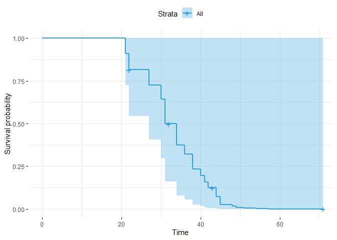

Analisis Survival
================
Analisis survival adalah metode statistik yang digunakan untuk menganalisis dan memprediksi waktu hingga terjadinya suatu peristiwa tertentu, dengan tujuan memperhitungkan kemungkinan terjadinya peristiwa tersebut pada periode waktu tertentu dan mengatasi data yang mungkin belum mengalami peristiwa (censored data).

## Persoalan

Soal:

Lakukan analisis survival dengan data yang tersedia (Refer to IC_Data
Analisis Survival.xlsx)

Terdapat 33 data pasien dengan 6 variabel (“Usia”, “Gender”, “Stadium”,
“Berat Badan”, “Gejala”, dan “Status”).

## Coding

### Library dan Read Data

``` r
#Library untuk data excel
library(readxl)

#Library untuk analisis survival
library(survival)
library(survminer)
```

    ## Loading required package: ggplot2

    ## Loading required package: ggpubr

    ## 
    ## Attaching package: 'survminer'

    ## The following object is masked from 'package:survival':
    ## 
    ##     myeloma

``` r
#Membaca file data excel
data <- read_excel("13_Analisis Survival/IC_Data Analisis Survival.xlsx")

#Mengecek file excel sudah dapat terbaca
View (data)
head(data)
```

    ## # A tibble: 6 × 7
    ##     No.  usia gender stadium berat_badan gejala status
    ##   <dbl> <dbl>  <dbl>   <dbl>       <dbl>  <dbl>  <dbl>
    ## 1     1    48      1       0          60      1      1
    ## 2     2    34      1       1          40      1      1
    ## 3     3    27      2       0          55      1      1
    ## 4     4    38      1       0          49      1      1
    ## 5     5    40      2       0          50      0      1
    ## 6     6    45      2       1          40      1      1

Dari sini terlihat bahwa data sudah terbaca dengan baik, di mana
terdapat 6 variabel dengan 33 baris data.

### Pemodelan Proportional Hazard (Multivariate)

Data akan diolah dengan variabel “Usia” sebagai time dan variabel
“Status” sebagai event.

``` r
#Model dari Proportional Hazard (Multivariate)
res.cox <- coxph(Surv(usia, status) ~ gender + stadium + berat_badan + gejala, data = data)
summary(res.cox)
```

    ## Call:
    ## coxph(formula = Surv(usia, status) ~ gender + stadium + berat_badan + 
    ##     gejala, data = data)
    ## 
    ##   n= 33, number of events= 29 
    ## 
    ##                 coef exp(coef) se(coef)      z Pr(>|z|)
    ## gender       0.26041   1.29746  0.53516  0.487    0.627
    ## stadium     -0.28615   0.75115  0.42167 -0.679    0.497
    ## berat_badan -0.02218   0.97807  0.04053 -0.547    0.584
    ## gejala      -1.17545   0.30868  0.84942 -1.384    0.166
    ## 
    ##             exp(coef) exp(-coef) lower .95 upper .95
    ## gender         1.2975     0.7707   0.45453     3.704
    ## stadium        0.7511     1.3313   0.32870     1.717
    ## berat_badan    0.9781     1.0224   0.90338     1.059
    ## gejala         0.3087     3.2396   0.05841     1.631
    ## 
    ## Concordance= 0.66  (se = 0.052 )
    ## Likelihood ratio test= 4.85  on 4 df,   p=0.3
    ## Wald test            = 5.92  on 4 df,   p=0.2
    ## Score (logrank) test = 6.83  on 4 df,   p=0.1

Dari hasil di atas, diketahui bahwa nilai concordance dari model adalah
0.66 (di atas 0.5) yang mengindikasikan bahwa model cukup baik untuk
memprediksi hasil.

### 

## Interpretasi Hasil dan Plot Proportional Hazard

``` r
#Membuat plot Cox-PH multivariate
ggsurvplot(survfit(res.cox), data = data, palette = "#2E9FDF", ggtheme = theme_minimal())
```

<!-- -->

Plot di atas menunjukkan kemungkinan survival relatif terhadap waktu
pengobatan.

Hasil pengolahan data adalah sebagai berikut:

| Variabel    | Hazard Ratio | p-value |
|-------------|--------------|---------|
| Gender      | 1.29746      | 0.627   |
| Stadium     | 0.75115      | 0.497   |
| Berat Badan | 0.97807      | 0.548   |
| Gejala      | 0.30868      | 0.166   |

Interpretasinya adalah sebagai berikut:

- Variabel “gender” memiliki p-value 0.627 dan hazard ratio (HR)
  1.29746. Angka tersebut menyatakan tidak ada hubungan kuat antara
  “gender” dengan terjadinya penyakit. HR menunjukkan bahwa “gender
  wanita” (gender=1) memiliki resiko 29% lebih tinggi untuk positif
  terkena penyakit

- Variabel “stadium” memiliki p-value 0.497 dan hazard ratio (HR)
  0.75115. Angka tersebut menyatakan tidak ada hubungan kuat antara
  “stadium” dengan terjadinya penyakit. HR menunjukkan bahwa “stadium
  berat” memiliki resiko 25% lebih rendah untuk positif terkena penyakit

- Variabel “berat badan” memiliki p-value 0.548 dan hazard ratio (HR)
  0.97807. Angka tersebut menyatakan tidak ada hubungan kuat antara
  “berat badan” dengan terjadinya penyakit. HR menunjukkan bahwa semakin
  besar “berat badan” maka kemungkinan positif terkena penyakit menurun
  sebanyak 3%

- Variabel “gejala” memiliki p-value 0.166 dan hazard ratio (HR)
  0.30868. Angka tersebut menyatakan tidak ada hubungan kuat antara
  “gejala” dengan terjadinya penyakit. HR menunjukkan bahwa adanya
  “gejala” menyebabkan kemungkinan positif terkena penyakit menurun
  sebanyak 70%


