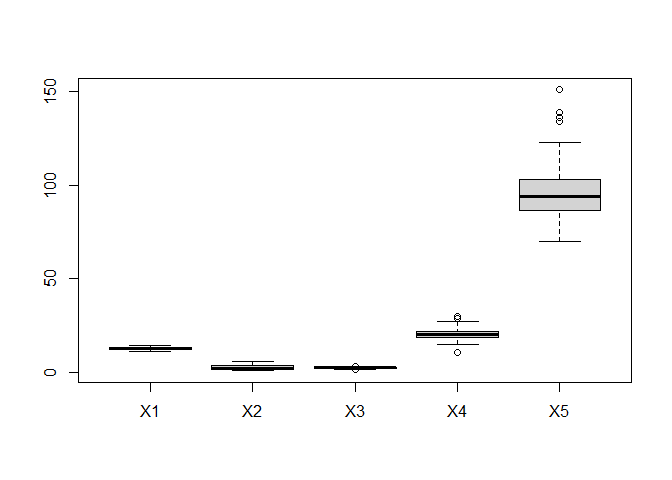
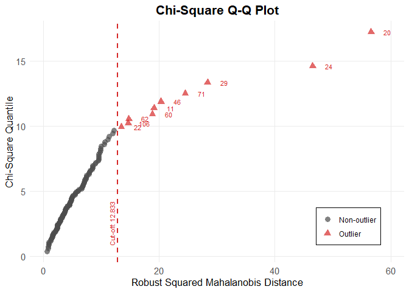
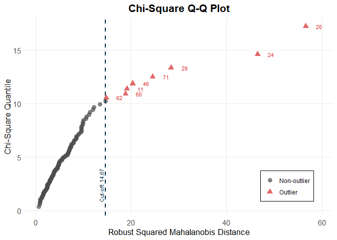

Analisis Outlier
================

Analisis outlier adalah proses untuk mengidentifikasi data yang secara
signifikan berbeda dari sebagian besar data lainnya dalam suatu kumpulan
data. Tujuannya adalah untuk mendeteksi nilai-nilai yang mungkin
merupakan kesalahan pencatatan, menunjukkan kondisi khusus, atau dapat
memengaruhi hasil analisis secara tidak wajar, sehingga perlu
dipertimbangkan untuk diteliti lebih lanjut atau dihapus.

# Persoalan

Soal:

Lakukan analisis outlier pada data yang disediakan (Refer to IC_Data
Outlier.xlsx)

Terdapat 124 data dengan 5 variabel.

# Metode Yang Digunakan

Metode yang akan digunakan untuk mengetahui data outlier adalah

a\. Metode boxplot (visual)

b\. Metode quantile yang berdasarkan Mahalanobis Distance

c\. Metode adjusted quantile yang berdasarkan Mahalanobis Distance

# Coding

## Library dan Read Data

``` r
#Library untuk data excel
library(readxl)

#Library untuk analisis outlier -> using MVN
library(MVN)

#Membaca file data excel
data1 <- read_excel("1_Analisis Outlier/IC_Data Outlier.xlsx")

#Mengecek file excel sudah dapat terbaca
View(data1)
head(data1)
```

    ## # A tibble: 6 × 5
    ##      X1    X2    X3    X4    X5
    ##   <dbl> <dbl> <dbl> <dbl> <dbl>
    ## 1  13.3  1.97  2.68  16.8   102
    ## 2  14.3  1.92  2.72  20     120
    ## 3  13.7  1.83  2.36  17.2   104
    ## 4  14.1  2.15  2.61  17.6   121
    ## 5  14.2  1.7   2.3   16.3   118
    ## 6  14.1  2.02  2.4   18.8   103

Dari sini terlihat bahwa data sudah bisa terbaca dengan baik, dimana
terdapat 5 variabel dengan 124 baris data.

## Metode Boxplot

``` r
#Mencari data yang termasuk outlier dengan metode boxplot
boxplot.stats(data1$X1)$out
```

    ## numeric(0)

``` r
boxplot.stats(data1$X2)$out
```

    ## numeric(0)

``` r
boxplot.stats(data1$X3)$out
```

    ## [1] 1.36 3.23

``` r
boxplot.stats(data1$X4)$out
```

    ## [1] 10.6 30.0 28.5 28.5

``` r
boxplot.stats(data1$X5)$out
```

    ## [1] 151 139 136 134

``` r
#Mencari pada baris ke-? data outlier berada pada X1
out <- boxplot.stats(data1$X1)$out
out_ind <- which(data1$X1 %in% c(out))
out_ind
```

    ## integer(0)

``` r
#Mencari pada baris ke-? data outlier berada pada X2
out <- boxplot.stats(data1$X2)$out
out_ind <- which(data1$X2 %in% c(out))
out_ind
```

    ## integer(0)

``` r
#Mencari pada baris ke-? data outlier berada pada X3
out <- boxplot.stats(data1$X3)$out
out_ind <- which(data1$X3 %in% c(out))
out_ind
```

    ## [1] 11 71

``` r
#Mencari pada baris ke-? data outlier berada pada X4
out <- boxplot.stats(data1$X4)$out
out_ind <- which(data1$X4 %in% c(out))
out_ind
```

    ## [1] 11 24 71 77

``` r
#Mencari pada baris ke-? data outlier berada pada X5
out <- boxplot.stats(data1$X5)$out
out_ind <- which(data1$X5 %in% c(out))
out_ind
```

    ## [1] 20 24 29 46

``` r
#Menampilkan boxplot
boxplot(data1)
```

<!-- -->

Dari sini kita dapat melihat bahwa terdapat outlier, dengan rincian
sebagai berikut:

a\. Tidak terdapat outlier pada variabel X1

b\. Tidak terdapat outlier pada variabel X2

c\. Pada X3, outlier terdapat pada baris 11 dan 71

d\. Pada X4, outlier terdapat pada baris 11, 24, 71, dan 77

e\. Pada X5, outlier terdapat pada baris 20, 24, 29, dan 46

Apabila suatu data pada variabel terdapat outlier, maka seluruh data
dalam satu baris tersebut termasuk outlier dan harus dihilangkan supaya
tidak mengganggu proses pengolahan data. Sehingga dapat disimpulkan
bahwa outlier yang ditemukan dengan metode boxplot adalah pada baris
data ke:

**11, 20, 24, 29, 71, dan 77**

Selain itu, kita juga dapat melihat visual boxplotnya dan terlihat bahwa
titik-titik outlier berada di variabel X3, X4, dan X5

## Metode Quantile

``` r
#Mendeteksi outlier menggunakan quantile method <- Mahalanobis distance
outlier_quant <- mv_outlier(data=data1, method = "quan")
outlier_quant$outlier
```

    ##     Observation Mahalanobis.Distance Outlier
    ## 1            20               56.586    TRUE
    ## 2            24               46.512    TRUE
    ## 3            29               28.369    TRUE
    ## 4            71               24.507    TRUE
    ## 5            46               20.329    TRUE
    ## 6            11               19.133    TRUE
    ## 7            60               18.831    TRUE
    ## 8            62               14.783    TRUE
    ## 9           106               14.670    TRUE
    ## 10           22               13.486    TRUE
    ## 11           77               12.267   FALSE
    ## 12            9               11.960   FALSE
    ## 13            2               11.427   FALSE
    ## 14            5               11.204   FALSE
    ## 15            4               10.615   FALSE
    ## 16           10               10.522   FALSE
    ## 17          100                9.994   FALSE
    ## 18           18                9.949   FALSE
    ## 19            1                9.915   FALSE
    ## 20           73                9.823   FALSE
    ## 21           98                9.618   FALSE
    ## 22          123                9.539   FALSE
    ## 23           50                9.539   FALSE
    ## 24           94                9.538   FALSE
    ## 25           23                9.447   FALSE
    ## 26           79                9.020   FALSE
    ## 27           59                8.974   FALSE
    ## 28           28                8.566   FALSE
    ## 29           92                8.548   FALSE
    ## 30           35                8.518   FALSE
    ## 31           27                8.429   FALSE
    ## 32           40                8.138   FALSE
    ## 33           14                7.968   FALSE
    ## 34           38                7.937   FALSE
    ## 35           85                7.890   FALSE
    ## 36           67                7.443   FALSE
    ## 37          121                7.440   FALSE
    ## 38          124                7.420   FALSE
    ## 39            7                7.330   FALSE
    ## 40           72                7.145   FALSE
    ## 41           33                7.122   FALSE
    ## 42           84                7.110   FALSE
    ## 43           74                7.102   FALSE
    ## 44           26                6.939   FALSE
    ## 45          117                6.883   FALSE
    ## 46           68                6.851   FALSE
    ## 47          120                6.797   FALSE
    ## 48          107                6.627   FALSE
    ## 49          105                6.604   FALSE
    ## 50           63                6.228   FALSE
    ## 51           78                6.063   FALSE
    ## 52           65                6.002   FALSE
    ## 53            6                5.670   FALSE
    ## 54          113                5.571   FALSE
    ## 55           17                5.526   FALSE
    ## 56          116                5.486   FALSE
    ## 57           91                5.207   FALSE
    ## 58          104                5.030   FALSE
    ## 59          103                5.003   FALSE
    ## 60           70                4.950   FALSE
    ## 61           12                4.892   FALSE
    ## 62           97                4.837   FALSE
    ## 63           19                4.817   FALSE
    ## 64           53                4.772   FALSE
    ## 65            8                4.729   FALSE
    ## 66            3                4.661   FALSE
    ## 67           45                4.577   FALSE
    ## 68           69                4.523   FALSE
    ## 69           95                4.508   FALSE
    ## 70          112                4.497   FALSE
    ## 71           16                4.215   FALSE
    ## 72           66                4.161   FALSE
    ## 73          102                4.118   FALSE
    ## 74           39                3.915   FALSE
    ## 75           90                3.899   FALSE
    ## 76           41                3.856   FALSE
    ## 77           64                3.793   FALSE
    ## 78           51                3.764   FALSE
    ## 79           47                3.703   FALSE
    ## 80          114                3.656   FALSE
    ## 81           93                3.631   FALSE
    ## 82           58                3.584   FALSE
    ## 83           54                3.479   FALSE
    ## 84           88                3.421   FALSE
    ## 85           13                3.367   FALSE
    ## 86           25                3.309   FALSE
    ## 87           99                3.282   FALSE
    ## 88           82                3.169   FALSE
    ## 89           31                3.070   FALSE
    ## 90          109                2.954   FALSE
    ## 91           49                2.939   FALSE
    ## 92           86                2.938   FALSE
    ## 93           57                2.936   FALSE
    ## 94           43                2.894   FALSE
    ## 95           34                2.735   FALSE
    ## 96           21                2.661   FALSE
    ## 97          111                2.659   FALSE
    ## 98           42                2.494   FALSE
    ## 99           30                2.448   FALSE
    ## 100         108                2.439   FALSE
    ## 101         122                2.435   FALSE
    ## 102          37                2.435   FALSE
    ## 103          81                2.396   FALSE
    ## 104          44                2.352   FALSE
    ## 105          36                2.273   FALSE
    ## 106          87                2.235   FALSE
    ## 107          56                2.171   FALSE
    ## 108         118                2.058   FALSE
    ## 109          48                1.845   FALSE
    ## 110          89                1.824   FALSE
    ## 111         110                1.760   FALSE
    ## 112          76                1.645   FALSE
    ## 113          15                1.621   FALSE
    ## 114         101                1.563   FALSE
    ## 115          75                1.537   FALSE
    ## 116         115                1.434   FALSE
    ## 117          32                1.255   FALSE
    ## 118          96                1.250   FALSE
    ## 119         119                0.977   FALSE
    ## 120          61                0.973   FALSE
    ## 121          80                0.960   FALSE
    ## 122          55                0.913   FALSE
    ## 123          52                0.824   FALSE
    ## 124          83                0.657   FALSE

``` r
outlier_quant$qq_outlier_plot
```

<!-- -->

Dari sini kita dapat melihat bahwa terdapat outlier yang ditemukan
dengan metode quantile (based on mahalanobis distance). Outlier tersebut
terletak pada baris data ke- :

**11, 20, 22, 24, 29, 46, 60, 62, 71, dan 106**

Selain itu, kita juga dapat melihat visual Q-Q Plot dan terlihat bahwa
ada titik-titik outlier yang ditandai dengan lambang segitiga merah.

## Metode Adjusted Quantile

``` r
#Mendeteksi outlier menggunakan adjusted quantile method <- Adjusted Mahalanobis Distance
outlier_adj <- mv_outlier(data=data1, method = "adj")
outlier_adj$outlier
```

    ##     Observation Mahalanobis.Distance Outlier
    ## 1            20               56.586    TRUE
    ## 2            24               46.512    TRUE
    ## 3            29               28.369    TRUE
    ## 4            71               24.507    TRUE
    ## 5            46               20.329    TRUE
    ## 6            11               19.133    TRUE
    ## 7            60               18.831    TRUE
    ## 8            62               14.783    TRUE
    ## 9           106               14.670    TRUE
    ## 10           22               13.486   FALSE
    ## 11           77               12.267   FALSE
    ## 12            9               11.960   FALSE
    ## 13            2               11.427   FALSE
    ## 14            5               11.204   FALSE
    ## 15            4               10.615   FALSE
    ## 16           10               10.522   FALSE
    ## 17          100                9.994   FALSE
    ## 18           18                9.949   FALSE
    ## 19            1                9.915   FALSE
    ## 20           73                9.823   FALSE
    ## 21           98                9.618   FALSE
    ## 22          123                9.539   FALSE
    ## 23           50                9.539   FALSE
    ## 24           94                9.538   FALSE
    ## 25           23                9.447   FALSE
    ## 26           79                9.020   FALSE
    ## 27           59                8.974   FALSE
    ## 28           28                8.566   FALSE
    ## 29           92                8.548   FALSE
    ## 30           35                8.518   FALSE
    ## 31           27                8.429   FALSE
    ## 32           40                8.138   FALSE
    ## 33           14                7.968   FALSE
    ## 34           38                7.937   FALSE
    ## 35           85                7.890   FALSE
    ## 36           67                7.443   FALSE
    ## 37          121                7.440   FALSE
    ## 38          124                7.420   FALSE
    ## 39            7                7.330   FALSE
    ## 40           72                7.145   FALSE
    ## 41           33                7.122   FALSE
    ## 42           84                7.110   FALSE
    ## 43           74                7.102   FALSE
    ## 44           26                6.939   FALSE
    ## 45          117                6.883   FALSE
    ## 46           68                6.851   FALSE
    ## 47          120                6.797   FALSE
    ## 48          107                6.627   FALSE
    ## 49          105                6.604   FALSE
    ## 50           63                6.228   FALSE
    ## 51           78                6.063   FALSE
    ## 52           65                6.002   FALSE
    ## 53            6                5.670   FALSE
    ## 54          113                5.571   FALSE
    ## 55           17                5.526   FALSE
    ## 56          116                5.486   FALSE
    ## 57           91                5.207   FALSE
    ## 58          104                5.030   FALSE
    ## 59          103                5.003   FALSE
    ## 60           70                4.950   FALSE
    ## 61           12                4.892   FALSE
    ## 62           97                4.837   FALSE
    ## 63           19                4.817   FALSE
    ## 64           53                4.772   FALSE
    ## 65            8                4.729   FALSE
    ## 66            3                4.661   FALSE
    ## 67           45                4.577   FALSE
    ## 68           69                4.523   FALSE
    ## 69           95                4.508   FALSE
    ## 70          112                4.497   FALSE
    ## 71           16                4.215   FALSE
    ## 72           66                4.161   FALSE
    ## 73          102                4.118   FALSE
    ## 74           39                3.915   FALSE
    ## 75           90                3.899   FALSE
    ## 76           41                3.856   FALSE
    ## 77           64                3.793   FALSE
    ## 78           51                3.764   FALSE
    ## 79           47                3.703   FALSE
    ## 80          114                3.656   FALSE
    ## 81           93                3.631   FALSE
    ## 82           58                3.584   FALSE
    ## 83           54                3.479   FALSE
    ## 84           88                3.421   FALSE
    ## 85           13                3.367   FALSE
    ## 86           25                3.309   FALSE
    ## 87           99                3.282   FALSE
    ## 88           82                3.169   FALSE
    ## 89           31                3.070   FALSE
    ## 90          109                2.954   FALSE
    ## 91           49                2.939   FALSE
    ## 92           86                2.938   FALSE
    ## 93           57                2.936   FALSE
    ## 94           43                2.894   FALSE
    ## 95           34                2.735   FALSE
    ## 96           21                2.661   FALSE
    ## 97          111                2.659   FALSE
    ## 98           42                2.494   FALSE
    ## 99           30                2.448   FALSE
    ## 100         108                2.439   FALSE
    ## 101         122                2.435   FALSE
    ## 102          37                2.435   FALSE
    ## 103          81                2.396   FALSE
    ## 104          44                2.352   FALSE
    ## 105          36                2.273   FALSE
    ## 106          87                2.235   FALSE
    ## 107          56                2.171   FALSE
    ## 108         118                2.058   FALSE
    ## 109          48                1.845   FALSE
    ## 110          89                1.824   FALSE
    ## 111         110                1.760   FALSE
    ## 112          76                1.645   FALSE
    ## 113          15                1.621   FALSE
    ## 114         101                1.563   FALSE
    ## 115          75                1.537   FALSE
    ## 116         115                1.434   FALSE
    ## 117          32                1.255   FALSE
    ## 118          96                1.250   FALSE
    ## 119         119                0.977   FALSE
    ## 120          61                0.973   FALSE
    ## 121          80                0.960   FALSE
    ## 122          55                0.913   FALSE
    ## 123          52                0.824   FALSE
    ## 124          83                0.657   FALSE

``` r
outlier_adj$qq_outlier_plot
```

<!-- -->

Dari sini kita dapat melihat bahwa terdapat outlier yang ditemukan
dengan metode adjusted quantile (based on adjusted mahalanobis
distance). Outlier tersebut terletak pada baris data ke- :

**11, 20, 24, 29, 46, 60, 62, 71, dan 106**

Selain itu, kita juga dapat melihat visual Q-Q Plot dan terlihat bahwa
ada titik-titik outlier yang ditandai dengan lambang segitiga merah.

# Kesimpulan

Telah ditampilkan hasil dari 3 metode yang ada dan bebas bagi kita ingin
menggunakan metode yang mana. Tetapi disini saya akan menarik kesimpulan
dengan menggunakan 3 metode tersebut, yaitu dengan menganggap baris data
ke-:

**11, 20, 22, 24, 29, 46, 60, 62, 71, 77, dan 106**

Untuk dianggap sebagai outlier dan sebaiknya dihapuskan sebelum
dilakukan pengolahan data lebih lanjut.

