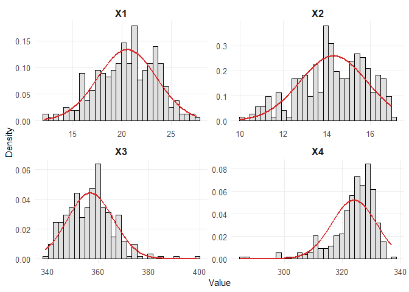

Uji Normalitas
================

**Uji normalitas data** adalah proses untuk mengevaluasi apakah
distribusi data mengikuti pola distribusi normal, yaitu distribusi yang
berbentuk simetris seperti lonceng. Tujuannya adalah memastikan
kesesuaian data dengan asumsi distribusi normal yang sering digunakan
dalam berbagai metode statistik.

## Persoalan

Soal:

Lakukan uji normalitas data pada data yang disediakan (Refer to IC_Data
Uji Normalitas.xlsx)

Terdapat 296 data dengan 4 variabel.

## Metode Yang Digunakan

Pada uji normalitas data ini, akan digunakan 8 metode yang terbagi atas
2 jenis, sebagai berikut:

Metode Univariate

- Histogram (Grafis)

- Lilliefors’ Test

- Shapiro-Wilk’s Test

- Anderson-Darling Test

Metode Multivariate

- Mardia’s Test

- Henze-Zirkler’s Test

- Royston’s Test

- Doornik-Hansen’s Test

- Energy Test

## Coding

### Library dan Read Data

``` r
#Library untuk data excel
library(readxl)

#Library untuk normality test
library(MVN)

#Membaca file data excel
data <- read_excel("3_Analisis Normalitas Data/IC_Data Uji Normal.xlsx")

#Mengecek file excel sudah dapat terbaca
View(data)
head(data)
```

    ## # A tibble: 6 × 4
    ##      X1    X2    X3    X4
    ##   <dbl> <dbl> <dbl> <dbl>
    ## 1  23.1  16.5  358.  330.
    ## 2  27.6  16.8  351.  329.
    ## 3  23.2  16.7  350.  329.
    ## 4  23.6  16.5  351.  331.
    ## 5  22.9  15.6  352.  333.
    ## 6  20.9  14.3  351.  332.

Dari sini terlihat bahwa data sudah bisa terbaca dnegan baik, di mana
terdapat 4 variabel dengan 296 baris data.

### Metode Histogram (Grafis)

``` r
#Menguji normalitas data dengan metode "Histogram"
univariate_diagnostic_plot(data, type="histogram", title=NULL, interactive=FALSE)
```

<!-- -->

Sebagaimana terlihat pada grafik di atas bahwa:

- X1 terdistribusi normal

- X2 tidak terdistribusi normal

- X3 tidak terdistribusi normal

- X4 tidak terdistribusi normal

### Metode Lilliefors’ Test

``` r
#Menguji normalitas data dengan metode "Lilliefors' Test" -> Univariate
test_univariate_normality(data, test="Lillie")
```

    ##              Test Variable  Statistic      p.value
    ## 1 Lilliefors (KS)       X1 0.04659598 1.219951e-01
    ## 2 Lilliefors (KS)       X2 0.05695964 2.156527e-02
    ## 3 Lilliefors (KS)       X3 0.04127376 2.534444e-01
    ## 4 Lilliefors (KS)       X4 0.13634829 1.592908e-14

Data variabel dianggap normal apabila memiliki nilai p-value \>0.05.
Sebagaimana terlihat pada tabel di atas bahwa:

- X1 terdistribusi normal

- X2 tidak terdistribusi normal

- X3 terdistribusi normal

- X4 tidak terdistribusi normal

### Metode Shapiro-Wilk’s Test

``` r
#Menguji normalitas data dengan metode "Shapiro-Wilk's Test" -> Univariate
test_univariate_normality(data, test="SW")
```

    ##           Test Variable Statistic      p.value
    ## 1 Shapiro-Wilk       X1 0.9907975 6.040334e-02
    ## 2 Shapiro-Wilk       X2 0.9735661 2.828942e-05
    ## 3 Shapiro-Wilk       X3 0.9684359 4.441137e-06
    ## 4 Shapiro-Wilk       X4 0.8652098 2.110833e-15

Data variabel dianggap normal apabila memiliki nilai p-value \>0.05.
Sebagaimana terlihat pada tabel di atas bahwa:

- X1 tidak terdistribusi normal

- X2 tidak terdistribusi normal

- X3 tidak terdistribusi normal

- X4 tidak terdistribusi normal

### Metode Anderson-Darling’s Test

``` r
#Menguji normalitas data dengan metode "Anderson-Darling's Test" -> Univariate
test_univariate_normality(data, test="AD")
```

    ##               Test Variable  Statistic      p.value
    ## 1 Anderson-Darling       X1  0.7641172 4.647250e-02
    ## 2 Anderson-Darling       X2  1.6400581 3.213212e-04
    ## 3 Anderson-Darling       X3  0.9756581 1.394280e-02
    ## 4 Anderson-Darling       X4 10.1185476 3.700000e-24

Data variabel dianggap normal apabila memiliki nilai p-value \>0.05.
Sebagaimana terlihat pada tabel di atas bahwa:

- X1 tidak terdistribusi normal

- X2 tidak terdistribusi normal

- X3 tidak terdistribusi normal

- X4 tidak terdistribusi normal

### Mardia’s Test

``` r
#Menguji normalitas data dengan metode "Mardia's Test" -> Multivariate
mardia(data)
```

    ##              Test  Statistic      p.value     Method
    ## 1 Mardia Skewness 311.416910 3.744570e-54 asymptotic
    ## 2 Mardia Kurtosis   9.905497 3.940072e-23 asymptotic

Data variabel dianggap normal apabila memiliki nilai p-value \>0.05.
Sebagaimana terlihat pada tabel di atas bahwa hasil Mardia Skewness dan
Kurtosis menunjukkan hasil bahwa semua variabel secara simultan
berdistribusi tidak normal.

### Henze-Zirkler’s Test

``` r
#Menguji normalitas data dengan metode "Henze-Zirkler's Test" -> Multivariate
hz(data)
```

    ##            Test Statistic     p.value     Method
    ## 1 Henze-Zirkler  3.185079 5.53357e-36 asymptotic

Data variabel dianggap normal apabila memiliki nilai p-value \>0.05.
Sebagaimana terlihat pada tabel di atas bahwa hasil Henze-Zirkler’s Test
menunjukkan hasil bahwa semua variabel secara simultan berdistribusi
tidak normal.

### Royston’s Test

``` r
#Menguji normalitas data dengan metode "Royston's Test" -> Multivariate
royston(data)
```

    ##      Test Statistic     p.value     Method
    ## 1 Royston  106.8915 3.43633e-22 asymptotic

Data variabel dianggap normal apabila memiliki nilai p-value \>0.05.
Sebagaimana terlihat pada tabel di atas bahwa hasil Royston’s Test
menunjukkan hasil bahwa semua variabel secara simultan berdistribusi
tidak normal.

### Doornik-Hansen’s Test

``` r
#Menguji normalitas data dengan metode "Doornik-Hansen's Test" -> Multivariate
doornik_hansen(data)
```

    ##             Test Statistic df       p.value     Method
    ## 1 Doornik-Hansen  962.9578  8 1.474563e-202 asymptotic

Data variabel dianggap normal apabila memiliki nilai p-value \>0.05.
Sebagaimana terlihat pada tabel di atas bahwa hasil Doornik-Hansen’s
Test menunjukkan hasil bahwa semua variabel secara simultan
berdistribusi tidak normal.

### Energy Test

``` r
#Menguji normalitas data dengan metode "Energy Test" -> Multivariate
energy(data)
```

    ##          Test Statistic p.value    Method
    ## 1 E-Statistic  4.586358       0 bootstrap

Data variabel dianggap normal apabila memiliki nilai p-value \>0.05.
Sebagaimana terlihat pada tabel di atas bahwa hasil Energy Test
menunjukkan hasil bahwa semua variabel secara simultan berdistribusi
tidak normal.

## Kesimpulan

Telah ditampilkan hasil dari 4 metode uji normalitas secara univariat
(uji per variabel) dan 5 metode uji normalitas secara multivariat (uji
simultan seluruh variabel). Berdasarkan hasil tersebut, dapat ditarik
kesimpulan sebagai berikut:

a\. Data yang diuji secara univariate menunjukkan bahwa:

- X1 terdistribusi normal pada uji histogram dan Lilliefors

- X2 tidak terdistribusi normal pada semua uji

- X3 hanya terdistribusi normal pada uji Lilliefors

- X4 tidak terdistribusi normal pada semua uji

b\. Data yang diuji secara multivariate menunjukkan bahwa:

- X1, X2, X3, dan X4 secara simultan memilki distribusi yang tidak
  normal

Sehingga, dataset yang diujikan dapat dianggap secara keseluruhan
memiliki distribusi tidak normal (non-normal distribution).

