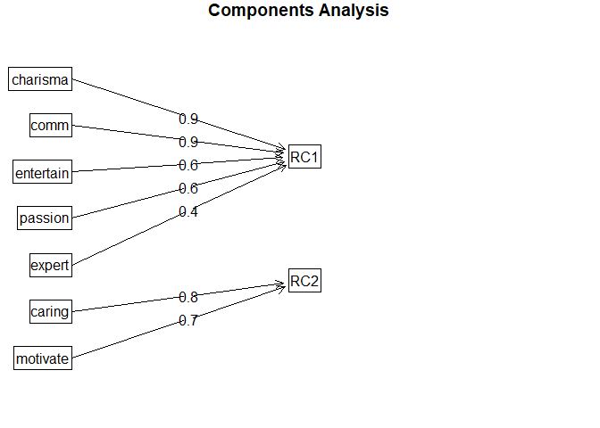
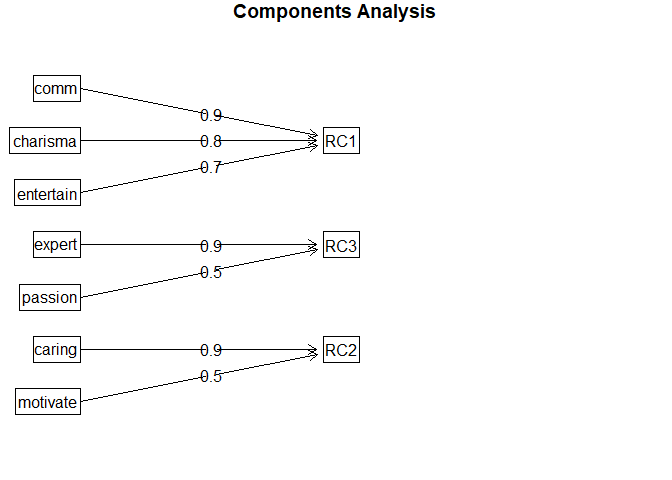

Analisis Faktor
================

**Analisis faktor** adalah metode statistik yang digunakan untuk
mengidentifikasi dan merangkum sejumlah besar variabel menjadi beberapa
faktor yang lebih sedikit, dengan tujuan menemukan struktur atau pola
hubungan di antara variabel-variabel tersebut.

## Persoalan

Soal:

Lakukan analisis faktor dengan data yang tersedia (Refer to IC_Data
Analisis Faktor.xlsx)

Terdapat 110 data dengan 9 variabel.

Obtain the principan component solution untuk m = 2 dan m = 3 common
factors

## Coding

### Library dan Read Data

``` r
#Library untuk data excel
library(readxl)

#Library untuk KMO
library(psych)

#Membaca file data excel
data <- read_excel("9_Analisis Faktor/IC_Data Analisis Faktor.xlsx")

#Mengecek file excel sudah dapat terbaca
View(data)
head(data)
```

    ## # A tibble: 6 × 10
    ##      No Expect Entertain  Comm Expert Motivate Caring Charisma Passion Friendly
    ##   <dbl>  <dbl>     <dbl> <dbl>  <dbl>    <dbl>  <dbl>    <dbl>   <dbl>    <dbl>
    ## 1     1      2         8     1      4        7      5        4       4        8
    ## 2     2      4         8     5      3        7      7        7       6        6
    ## 3     3      2         8     2      3        6      7        1       3        7
    ## 4     4      4         8     4      2        8      7        7       5        7
    ## 5     5      3         8     5      4        8      8        7       6        7
    ## 6     6      4         7     3      3        6      6        1       4        7

Dari sini terlihat bahwa data sudah terbaca dengan baik, di mana
terdapat 9 variabel (“Expect”, “Entertain”, “Comm”, “Expert”,
“Motivate”, “Caring”, “Charisma”, “Passion”, “Friendly”) dengan 110
baris data.

### Mendefinisikan Variabel dan Membuat Model

``` r
#Menentukan variabel
expect <-(data$Expect)
entertain <- (data$Entertain) 
comm <- (data$Comm)
expert <- (data$Expert)
motivate <- (data$Motivate)
caring <- (data$Caring)
charisma <- (data$Charisma)
passion <- (data$Passion)
friendly <- (data$Friendly)

#Membuat model di R
model <- cbind(expect, entertain, comm, expert, motivate, caring, charisma, passion, friendly)
```

Berikut ini kita definisikan variabelnya dan membuat modelnya.

### Uji Asumsi

Sebelum dilakukan analisis faktor, dataset perlu diuji asumsi terlebih
dahulu menggunakan uji Kaiser-Meyer-Olkin (KMO) Factor Adequacy dan Uji
Bartlett.

``` r
#Uji KMO
KMO(model)
```

    ## Kaiser-Meyer-Olkin factor adequacy
    ## Call: KMO(r = model)
    ## Overall MSA =  0.69
    ## MSA for each item = 
    ##    expect entertain      comm    expert  motivate    caring  charisma   passion 
    ##      0.56      0.70      0.67      0.65      0.82      0.68      0.70      0.83 
    ##  friendly 
    ##      0.51

``` r
#Uji Bartlett
cortest.bartlett(model)
```

    ## R was not square, finding R from data

    ## $chisq
    ## [1] 234.6699
    ## 
    ## $p.value
    ## [1] 5.477016e-31
    ## 
    ## $df
    ## [1] 36

Hasil di atas menunjukkan bahwa variabel “Expect” dan “Friendly” memilki
nilai measure of sampling adequacy yang rendah (MSA \<0.6) walaupun
hasil Bartlett Test \<0.05. Dapat dianggap bahwa model ini tidak bisa
langsung dilanjut ke analisis faktor dan perlu perbaikan terlebih
dahulu.

### Tahap Perbaikan

Perbaikan model dilakukan dengan mengeliminasi variabel yang dianggap
tidak fit dengan model yaitu variabel “Expect” dan “Friendly”. Setelah
dieliminasi, lakukan ulang uji asumsi

``` r
#Perbaikan model (Dilakukan apabila KMO menunjukkan nilai <0,6 dan/atau pvalue Bartlett Test >0,05)
modelfix <- cbind(entertain, comm, expert, motivate, caring, charisma, passion)

#Uji KMO dan Bartlett ulang
KMO(modelfix)
```

    ## Kaiser-Meyer-Olkin factor adequacy
    ## Call: KMO(r = modelfix)
    ## Overall MSA =  0.74
    ## MSA for each item = 
    ## entertain      comm    expert  motivate    caring  charisma   passion 
    ##      0.85      0.67      0.76      0.82      0.71      0.69      0.83

``` r
cortest.bartlett(modelfix)
```

    ## R was not square, finding R from data

    ## $chisq
    ## [1] 180.7783
    ## 
    ## $p.value
    ## [1] 2.093451e-27
    ## 
    ## $df
    ## [1] 21

Hasil di atas menunjukkan bahwa tidak ada lagi variabel dengan nilai MSA
\<0.6 dan p-value dari Bartlett Test \<0.05. Sehingga dapat disimpulkan
bahwa setelah perbaikan, model bisa dilanjutkan ke analisis faktor.

### Principal Component Solution Dengan m = 2 Common Factors

Metode analisis faktor yang digunakan adalah Principal Component
Analysis (PCA) dengan cara rotation = varimax dan 2 common factors.

``` r
#Principal Factor Analysis dengan m=2 common factors
principal.m2 <- principal(modelfix, nfactors = 2, rotate = "varimax", scores = TRUE)

principal.m2
```

    ## Principal Components Analysis
    ## Call: principal(r = modelfix, nfactors = 2, rotate = "varimax", scores = TRUE)
    ## Standardized loadings (pattern matrix) based upon correlation matrix
    ##             RC1   RC2   h2   u2 com
    ## entertain  0.65  0.16 0.45 0.55 1.1
    ## comm       0.86 -0.02 0.74 0.26 1.0
    ## expert     0.40  0.34 0.28 0.72 1.9
    ## motivate   0.28  0.66 0.52 0.48 1.3
    ## caring    -0.09  0.80 0.65 0.35 1.0
    ## charisma   0.87  0.11 0.77 0.23 1.0
    ## passion    0.56  0.45 0.52 0.48 1.9
    ## 
    ##                        RC1  RC2
    ## SS loadings           2.48 1.43
    ## Proportion Var        0.35 0.20
    ## Cumulative Var        0.35 0.56
    ## Proportion Explained  0.63 0.37
    ## Cumulative Proportion 0.63 1.00
    ## 
    ## Mean item complexity =  1.3
    ## Test of the hypothesis that 2 components are sufficient.
    ## 
    ## The root mean square of the residuals (RMSR) is  0.12 
    ##  with the empirical chi square  66.61  with prob <  2.3e-11 
    ## 
    ## Fit based upon off diagonal values = 0.86

``` r
fa.diagram(principal.m2)
```

<!-- -->

Berdasarkan hasil di atas, diketahui test of hypothesis menyatakan bahwa
2 components sudah mencukupi.

Kemudian, dapat disimpulkan bahwa:

- Faktor 1 -\> Variabel “Entertain”, “Comm”, “Expert”, “Charisma”, dan
  “Passion”

- Faktor 2 -\> Variabel “Motivate” dan “Caring”

Hal tersebut juga terlihat pada diagram yang tercantum.

### Principal Component Solution Dengan m = 3 Common Factors

Metode analisis faktor yang digunakan adalah Principal Component
Analysis (PCA) dengan cara rotation = varimax dan 3 common factors.

``` r
#Principal Factor Analysis dengan m=3 common factors
principal.m3 <- principal(modelfix, nfactors = 3, rotate = "varimax", scores = TRUE)

principal.m3
```

    ## Principal Components Analysis
    ## Call: principal(r = modelfix, nfactors = 3, rotate = "varimax", scores = TRUE)
    ## Standardized loadings (pattern matrix) based upon correlation matrix
    ##            RC1   RC3   RC2   h2   u2 com
    ## entertain 0.74 -0.03  0.23 0.59 0.41 1.2
    ## comm      0.87  0.13 -0.03 0.77 0.23 1.0
    ## expert    0.08  0.91 -0.03 0.84 0.16 1.0
    ## motivate  0.19  0.45  0.53 0.53 0.47 2.2
    ## caring    0.02 -0.04  0.90 0.81 0.19 1.0
    ## charisma  0.81  0.34  0.01 0.77 0.23 1.3
    ## passion   0.46  0.48  0.30 0.53 0.47 2.7
    ## 
    ##                        RC1  RC3  RC2
    ## SS loadings           2.21 1.40 1.23
    ## Proportion Var        0.32 0.20 0.18
    ## Cumulative Var        0.32 0.52 0.69
    ## Proportion Explained  0.46 0.29 0.25
    ## Cumulative Proportion 0.46 0.75 1.00
    ## 
    ## Mean item complexity =  1.5
    ## Test of the hypothesis that 3 components are sufficient.
    ## 
    ## The root mean square of the residuals (RMSR) is  0.11 
    ##  with the empirical chi square  56.8  with prob <  2.8e-12 
    ## 
    ## Fit based upon off diagonal values = 0.88

``` r
fa.diagram(principal.m3)
```

<!-- -->

Berdasarkan hasil di atas, diketahui test of hypothesis menyatakan bahwa
3 components sudah mencukupi.

Kemudian, dapat disimpulkan bahwa:

- Faktor 1 -\> Variabel “Entertain”, “Comm”, “Expert”, dan “Charisma”

- Faktor 2 -\> Variabel “Motivate” dan “Caring”

- Faktor 3 -\> Variabel “Expert” dan “Passion”

Hal tersebut juga terlihat pada diagram yang tercantum.

